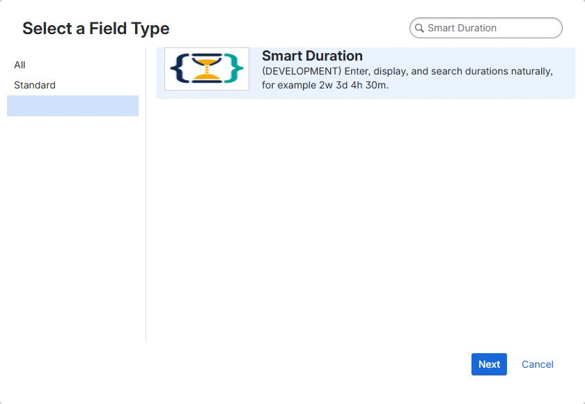

# Create a Smart Duration field

You need Jira administrator permission to create a global custom field in a company-managed space. Space administrators can create fields in team-managed spaces where Jira allows it.

## 1. Open the custom fields page

In Jira, open **Settings → Work items → Fields** and select **Create custom field**.

Depending on your Jira navigation, the page may still be named **Custom fields**.

## 2. Select Smart Duration

1. Select the **Advanced** category.
2. Search for **Smart Duration**.
3. Select the Smart Duration field type and choose **Next**.



!!! note

    Development installations display a **DEVELOPMENT** label beside the field type. Marketplace installations do not use that development label.

## 3. Name the field

Use a name that describes what the duration controls. Examples include:

- **Analysis estimate**
- **Development estimate**
- **Test estimate**
- **Analysis budget**

Add a description that tells users what should be entered, then select **Create**.

## 4. Add the field to screens

Select the create, edit, and view screens where the field should be available. If the field does not appear on a work item, check both its screen assignment and its field context.

## 5. Synchronize the app settings

After adding a new Smart Duration field or a new field context:

1. Open the [Smart Duration Field settings](settings.md).
2. Confirm the working-time values.
3. Select **Save settings**, even if the values did not change.
4. Select **Rebuild JQL index** if you want to use the Time Spent comparison functions.

Saving synchronizes the global working-time settings to every existing Smart Duration field context. Rebuilding indexes existing values for the comparison functions.

## Enter a value

Users can enter one or more units:

```text
2w
5d
4h 30m
1w 2d 4h
1.5d
```

Supported units are `w`, `d`, `h`, `m`, and `s`. Decimal commas are also accepted, for example `1,5h`.

With the default calendar, `1d` is 8 hours and `1w` is 5 working days or 40 hours.
