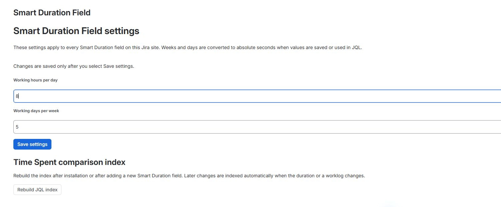

# Global working-time settings

Smart Duration Field uses one working-time configuration for every Smart Duration field on the Jira site.

The defaults are:

| Setting | Default |
|---|---:|
| Working hours per day | 8 |
| Working days per week | 5 |

With these defaults, `1d` equals 8 hours and `1w` equals 40 hours.

## Open the settings

1. In Jira, open **Apps → Manage apps**.
2. Open **Connected apps** when Jira redirects you to Atlassian Administration.
3. Find **Smart Duration Field**.
4. Open its actions menu and select **Configure**.

The exact navigation labels may vary slightly as Atlassian updates Jira administration.

## Change the working calendar

1. Enter a positive number in **Working hours per day**.
2. Enter a positive number in **Working days per week**.
3. Select **Save settings**.

Decimal values are supported, so a working day can be configured as `7.5` hours.

!!! warning

    Changing the working calendar does not rewrite stored seconds. It changes how `w` and `d` are interpreted for new input and JQL, and how existing values are displayed.

For example, a stored value of 144,000 seconds is displayed as `1w` with an 8-hour day and 5-day week. With a 9-hour day and 5-day week, the same stored value is displayed as `4d 4h`.

## After creating another field or context

Select **Save settings** again after creating a new Smart Duration field or field context. This synchronizes the global values to that new context.

## Time Spent comparison index

Select **Rebuild JQL index**:

- after installing the app,
- after creating a new Smart Duration field,
- or when existing issues are missing from Time Spent comparison results.

Later changes are indexed automatically when a Smart Duration value or worklog changes. Updates can take a short time to appear in JQL.
